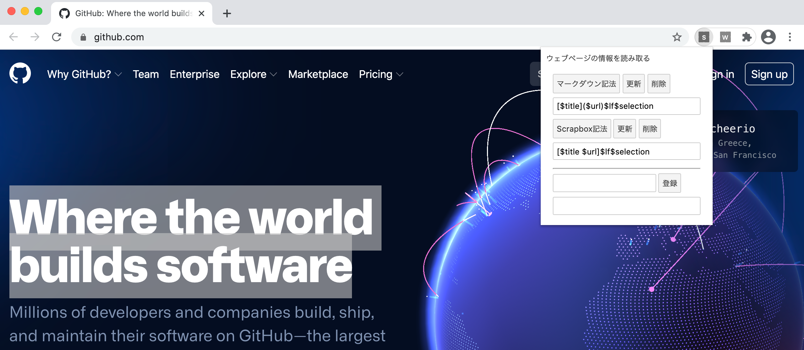

# svelte3-google-chrome-extension

このリポジトリーは、技術書典10「[いまからはじめる Svelte3](https://techbookfest.org/product/4925576424980480?productVariantID=5094401858600960)」第３章のサンプルコードです。



## サンプルコードの試しかた

リポジトリーをクローンしたら、npmパッケージをインストールします。

```bash
cd svelte-app
npm install
```

そして、[Rollup](https://rollupjs.org)のモジュール・バンドル処理を実行し...

```bash
npm run build
```

[web-ext](https://www.npmjs.com/package/web-ext)でウェブブラウザーを起動すると...

```bash
npm run google
```

アドレスバーの右側のアイコンに拡張機能が並んでいます。
